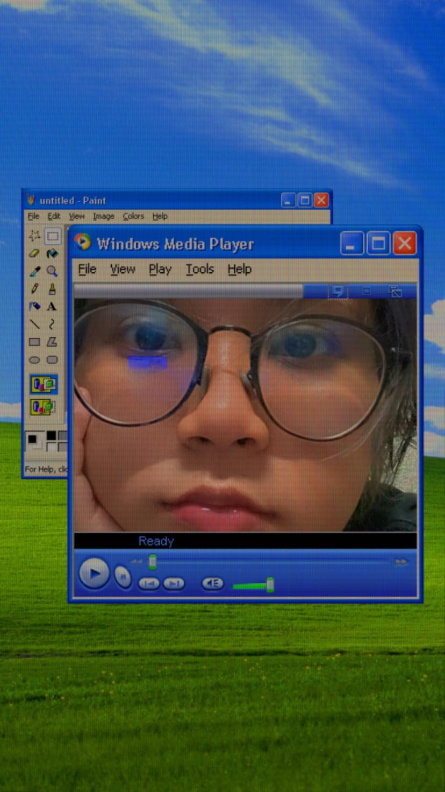

# SquitGame
เป็นเกมจับการเคลื่อนไหว โดยเมื่อกดรันโปรแกรม จะเด้งหน้าจอ กล้องของเราขึ้นมา โดย ระบบของเกมนั้นจะมี  
อยู่ 2 ช่วงคือจะมีช่วงที่สามารถขยับได้ กับช่วงที่ห้ามขยับ โดยตัวเกมจะมีการจับการเคลื่อนไหวอยู่ตลอดเวลา  
ช่วงที่สามารถขยับได้จะมีตัวอักษรสีเขียวขึ้นมา ถ้าตัวอักษรเปลี่ยนเป็นสีเหลือง แปลว่า ใกล้ที่ถึงช่วงที่จะขยับไม่ได้แล้ว  
(โดยระยะเวลา ที่สามารถขยับได้ กับ ขยับไม่ได้ นั้นจะเป็นการสุ่มทั้งหมด) ถ้าตัวอักษรหายไปจากหน้าจอ  
แปลว่า ห้ามขยับ โดย
- วิธีการชนะคือ ช่วงที่สามารถขยับได้ ผู้เล่นจะต้องทำการขยับตัวไปเรื่อยๆ ทุกๆการขยับตัวจะมีการ  
นับคะแนน เมื่อครบ 1000 คะแนน จะถือว่าชนะ  
- วิธีการแพ้ คือ สมมุติถ้าเผลอขยับตัวตอนที่ห้ามขยับจะถือว่าตายและแพ้ทันที  
(แนะนำให้ปิดพัดลมตอนเล่นเพราะแค่การขยับของผลที่ปลิ้วก็มีสิทธิที่จะแพ้ได้)

ลิ้งรายงาน SquitGame : https://docs.google.com/document/d/12B0p4ZGuovyd7Q3VgMRkL-uIggnji__yZgnDAZoUpIg/edit?usp=sharing

สมาชิก
<table>
	<tr align="center">
		<td></td>
		<td>ชื่อ : นางสาววิลาวัณย์ ใจงามเลิศวงศ์	รหัสนักศึกษา</td>
		<td>รหัสนักศึกษา : 61070209</td>
		<td><a href="https://github.com/wirawan05595">wirawan05595</a></td>
	</tr>
	<tr align="center">
		<td></td>
		<td>ชื่อ : นางสาวลลิตา สอาดเหลือ	</td>
		<td>รหัสนักศึกษา : 61070346</td>
		<td><a href="https://github.com/lalitaSa">lalitaSa</a></td>
	</tr>
	<tr align="center">
		<td></td>
		<td>ชื่อ : นายเอกณัฐ หิรัญนุชนาถ</td>
		<td>รหัสนักศึกษา : 64070118</td>
		<td><a href="https://github.com/Ekanat33">Ekanat33</a></td>
	</tr>
	<tr align="center">
		<td></td>
		<td>ชื่อ : นายณัฐพล ดิษฐวิบูลย์</td>
		<td>รหัสนักศึกษา : 64070146</td>
		<td><a href="https://github.com/Bug9Best">Bug9Best</a></td>
	</tr>
</table>
